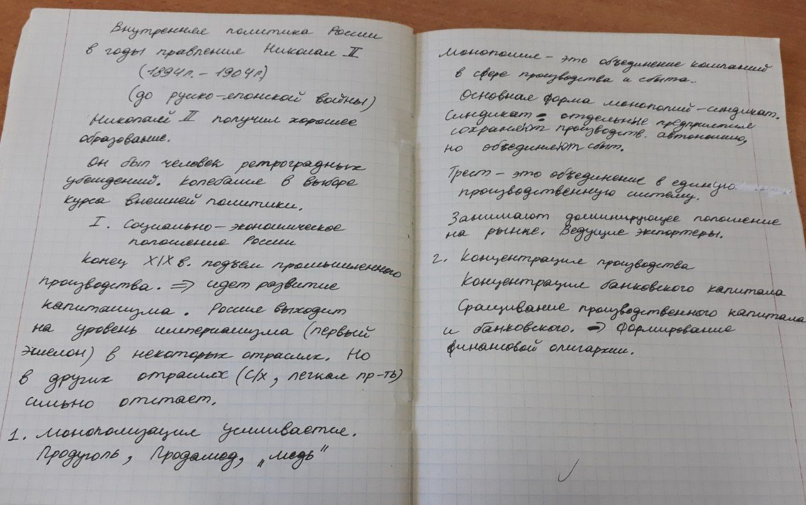

# Николай II - Внутренняя политика

Увеличивались иностранные инвестиции
- Приводило к экономическому росту
- Мешало развитию собственных технологий
- Иностранная буржуазия вывозила часть капитала

Негативно сказался и на темпах экономического роста в России, и на политической ситуации России мировой кризис 1900-1903 года

## Политическая сфера
**Курс** - консервативное направление

