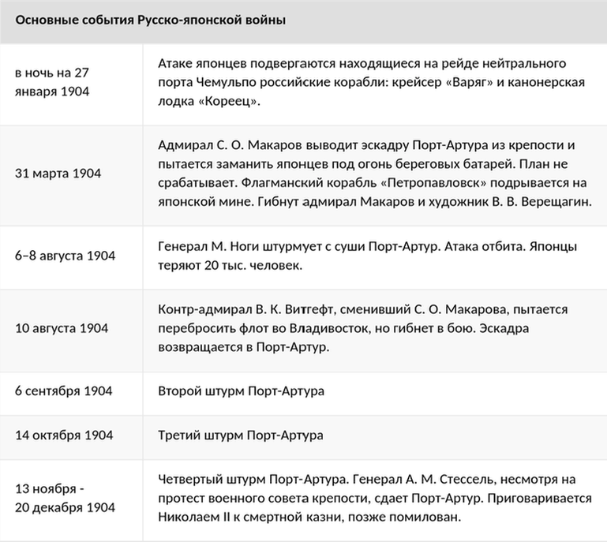
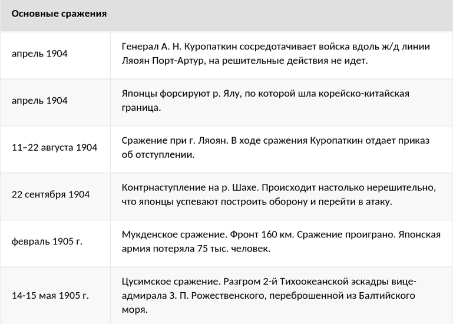

# Русско-японская война

## Причины
- Личная неприязнь Николая II к Японии из-за нападения японского полицейского во время его пребывания в Японии (1891)
- Противостояние России и Японии на Дальнем Востоке
	- Аренда Россией Ляодунского полуострова и Порт-Артура как военно-морской базы
	- КВЖД и российская  экономическая экспансия в Маньчжурии
	- Борьба за сферы влияния в Китае и Корее
- Война как средство отвлечения от революционного движения в России ("маленькая победоносная война")
- **Япония разрывает дипломатические отношения с Россией (24.01.1904)**

## Предпосылки
- Ноты Николая II, Гаагские конференции (1899, 1907)
	- 16 конвенций, 3 декларации
- Победа Японии в войне с Китаем (1894)
	- Острова
	- Контрибуция
- Россия -> Китай: 150 млн рублей
	- Русско-китайский банк
- Русско-китайский договор об оборонительном союзе против Японии
- Договор о строительстве Китайско-восточной ж/д
- Россия арендует у Китая Квантунский полуостров с Порт-Артуром с правом создания на нем военно-морской базы
- **Союзный договор между Японией и Англией (1902)**
- Неудачные переговоры с Японией (08-10.1903)
	- С 1901 В Петербурге велись переговоры о разграничении сфер влияния России и Японии в Маньчжурии. В декабре 1903 Япония ультимативно потребовала изменения позиции русского правительства.
- **Япония разрывает дипломатические отношения с Россией (24.01.1904)**
- **Японский флот без объявления войны атакует российскую эскадру на рейде Порт-Артура (ночь на 27.01.1904)**
	- - 3 русских корабля
- Утром 27.01.1904 в корейском порту Чемульпо выход в море русским кораблям перекрыла японская эскадра
	- В неравном бою крейсер "Варяг" затоплен, канонерская лодка "Кореец" взорвана
- ==Япония объявляет войну России (28.01.1904)==

## Хронология
- На начальном этапе войны русская эскадра в Порт-Артуре ведет оборонительные действия
- **24.02.1904** - В Порт-Артур прибывает вице-адмирал Макаров и начинает готовить эскадру к активным действиям
- **31.03.1904** - Макаров и весь штаб погибает на броненосце "Петропавловск", подорвавшемся на мине
	- Новое руководство (Витгефт) отказывается от борьбы за господство на море, эскадра ориентирована на оборону Порт-Артура
- **02-04.1904** - Высадка японских войск на Ляодунском полуострове и в Маньчжурии
- **18.04.1904** - Бой на реке Ялу
	- Русский Восточный отряд разбит 1-й японской армией
- **13.05.1904** - Крепость Порт-Артур отрезана от основных русских сил
- **22.09.1904, 04.10.1904** - Сражения на реке Шахэ - окончились безрезультатно
	- Образовался позиционный фронт протяженностью до 60 километров
- **08-12.1904** - 6 японских штурмов крепости Порт-Артур
- **20.12.1904** - После гибели Кондратенко (руководителя обороны крепости) крепость сдана генералом Стесселем, вопреки мнению военного совета
- **01.1905** - Русские армии образовали фронт протяженностью около 100 километров на реке Шахэ
- **06-25.02.1905** - Мукденское сражение (самое крупное)
	- Поражение русских, потерпевших огромные потери и отошедших севернее
- **14-16.05.1905** - Цусимское сражение
	- 2-я русская Тихоокеанская эскадра после 18000-мильного перехода вела бой с японским флотом и была полностью разгромлена

## Завершение войны
- **Обе стороны стремились к завершению войны**
	- Япония была истощена, ее потери превосходили русские
	- В России тем временем началась революция
- **27.07.1905** - Переговоры о мире в Портсмуте (США)
- **23.08.1905** - *Портсмутский договор*

## Причины поражения России
- Реакционность правительства
- Бездарность высшего военного командования
- Низкое качество подготовки
- Недостаточное материально-техническое обеспечение (в отличие от Японии, которая покрыла 40% военных расходов благодаря займам от США и Великобритании)
- Плохое знание театра военных действий
- Непопулярность войны среди народа

## Итоги
- **Портсмутский договор** (23.08.1905)
	- Россия признает Корею сферой Японского влияния -> **Утверждение Японии в Корее**
	- Россия -> Япония: арендные права на Квантунскую область с Порт-Артуром, южную ветку КВЖД, южную часть Сахалина
	- Закреплено коммерческое использование маньчжурских дорог обеими сторонами
	- Контрибуции не выплачиваются, но Россия платит Японии за содержание русских военнопленных
	- *Успех российской дипломатии*: условия договора были ближе к российской программе мира
- Опыт войны был использован при проведении военных реформ 1905–1912 в России
- Ухудшение материального положения народов России и Японии
- Ускорение Первой российской революции 1905-1907

