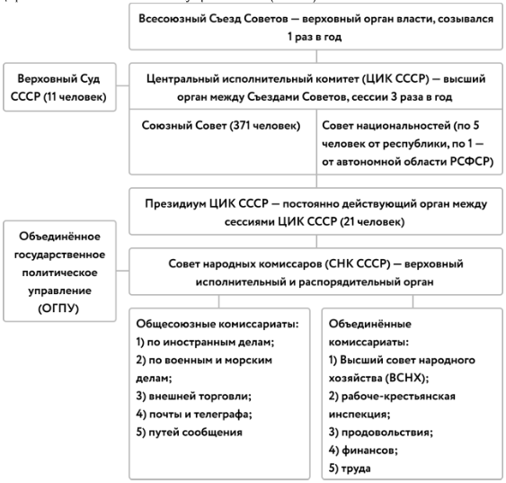
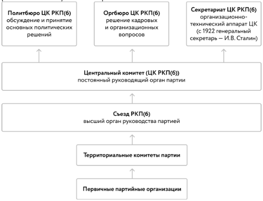

# Образование СССР

## Предпосылки

- **Экономические**: общие хозяйственные связи, взаимозависимость районов
- **Международные**: создание единой системы внешней безопасности
- **Идеологические**: общая цель - строительство социализма
- **Культурные**: общая история, принадлежность к единому великому государству
- **Политические**: советская система власти во всех республиках, единая партия - РКП

## Планы

**Автономизация** - принцип создания СССР, предложенный **И.В. Сталиным** и предусматривающий вхождение республик в состав РСФСР на правах автономий без права выхода из неё

**Федерализация** - принцип создания СССР, предложенный **В.И. Лениным** и предусматривавший вхождение республик в состав союзного государства на равных условиях и с правом выхода из него - **одобрен ЦК РКП**

## Органы власти

## Хронология вхождения республик

- **1924** - Туркменская ССР
- **1925** - Узбекская ССР
- **1929** - Таджикская ССР
- **1936**
	- Азербайджанская ССР
	- Армянская ССР
	- Грузинская ССР
	- Казахская ССР
	- Киргизская ССР
- **1940**
	- Карело-Финская ССР
	- Молдавская ССР
	- Литовская ССР
	- Латвийская ССР
	- Эстонская ССР

## Внутрипартийная борьба

### Структура РПК

### Этапы ("за" против "против")

1. **1923-24** - Сталин, Каменев, Зиновьев против Троцкого ("левой оппозиции")
	- Взгляды Троцкого осуждены, он снят с о своих постов, но оставлен в Политбюро
2. **1925-27** - Сталин, Бухарин, Рыков против Каменева, Зиновьева ("новая оппозиция"), а затем еще и Троцкого ("объединенная оппозиция")
	- Каменев, Зиновьев и Троцкий исключены из партии и отправлены в ссылку.
	   В итоге Троцкий был выслан из СССР и в 1940 убит агентом НКВД в Мексике
3. **1928-29** - Бухарин, Рыков, Томский ("правая оппозиция") против Сталина, Молотова, Ворошилова
	- ЦК ВКП осудил позицию Бухарина, Рыкова и Томского как "правый уклон" и лишил их партийных должностей

### Причины победы Сталина
- Неустойчивость экономического развития СССР в условиях НЭПа, кризисы которого ставили партийное руководство перед новыми вызовами и провоцировали новые дискуссии
- Неспособность международного рабочего движения организовать победу социалистической революции в странах Запада, что делало сталинский тезис о построении социализма в отдельно взятой стране привлекательным для большинства партийцев
- С 1922 Сталин, будучи генсеком ЦК, **контролировал кадровую политику и организационную деятельность партии**
- "Ленинский призыв" в середине 1920-х существенно увеличил численность партийного руководства, что позволило Сталину **сформировать многочисленную группу поддержки**
- Сталин наиболее последовательно **соблюдал резолюцию «О единстве партии»**, что позволяло ему на каждом этапе борьбы свергать своих оппонентов
- **Гибкость теоретических взглядов** Сталина позволяла учитывать изменчивую обстановку в стране и мире и формулировать наиболее близкие и понятные для трудящихся масс теоретические тезисы
