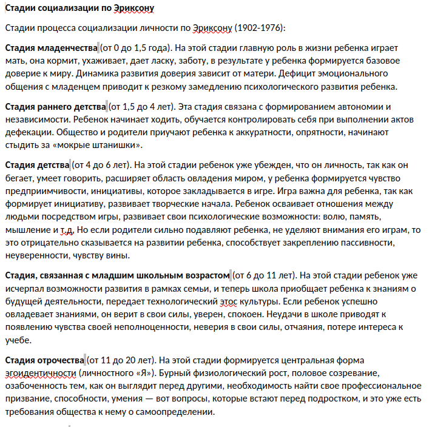
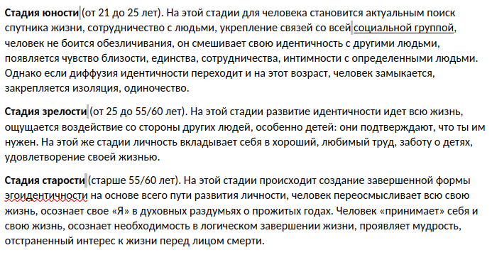

# Социализация
> Жизненно важный процесс усвоения индивидом социальных норм, культурных ценностей и образцов поведения общества, к которому он принадлежит
- передача и овладение знаниями, умениями, навыками
- формирование ценностей, идеалов, норм и правил социального поведения

## Термины
***Агенты социализации*** — это конкретные **люди**, ответственные за обучение культурным нормам и социальным ценностям  
***Институты социализации*** — **учреждения**, влияющие на процесс социализации и направляющие его

***Ресоциализация*** - усвоение новых норм взамен старых  
***Десоциализация*** - утрата навыков социального поведения  
***Девиация*** - отклонения в социализации

## Типы социализации
- **Первичная** - усвоение норм и ценностей ребенком
	- *Агенты* - родственники, друзья, учителя - **непосредственное окружение**
	- *Институты* - семья, школа, группа сверстников
- **Вторичная** - усвоение новых норм и ценностей взрослым человеком
	- *Агенты* - представители администрации (школы, университеты, предприятия, армии), сотрудники СМИ
	- *Институты* - государство и его органы, университеты, церковь, СМИ

## Стадии социализации
- **Адаптации** (рождение - подростковый период) - некритическое усвоение социального опыта; механизм - **подражание**
- **Идентификации** - появление желания выделить себя среди других
- **Интеграции** - внедрение в жизнь общества
- **Трудовая** - воспроизведение социального опыта, воздействие на среду
- **Послетрудовая** - передача социального опыта новым поколениям

## Факторы, влияющие на социализацию
- биологическая наследственность
- физическое окружение
- культура, социальное окружение
- групповой опыт
- индивидуальный опыт

> Модель социализации определяется тем, каким ценностям привержено общество
